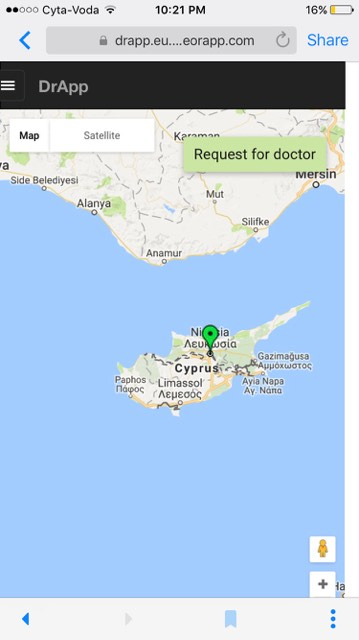
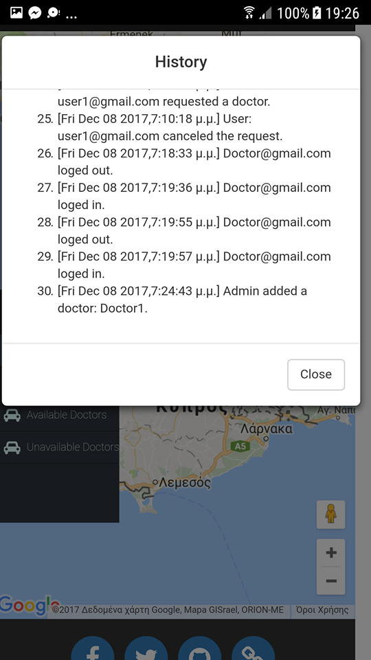

DrApp
==============

A Meteor application base on Meteor starter boilerplate with a lot packed in. Written in Javascript and Coffeescript.

[Meteor Starter Demo](http://starter.meteor.com) - For admin, log in with: `starter@meteorfactory.io` and `meteorrocks`

[Meteor Starter Github](https://github.com/yogiben/meteor-starter)

[Tutorials Followed for starting developing](http://learn.meteorfactory.io/meteor-starter/)

[Map and Markers](http://meteorcapture.com/how-to-create-a-reactive-google-map/) - Example article based on which markers are placed on map

[MIT License](http://choosealicense.com/licenses/mit/)

### Setup for Desktop (localhost) ####

```
cd myapp
meteor reset
meteor
```

### Setup for Desktop (remote server) ####

```
cd myapp
export ROOT_URL=<host_https_url>
export DPP_DEFAULT_CONNECTION_URL=<host_https_url>
meteor reset
meteor build <build-output-directory> --server=<host_https_url>:<port>
DEPLOY_HOSTNAME=eu-west-1.galaxy-deploy.meteor.com meteor deploy drApp --settings settings.json
meteor \
 --settings ./settings.json \
 --mobile-server <host_https_url>:<port> \
 --verbose 
 ```

### Setup for Android (localhost) ####
###### 1. Cordova installation is also needed to take the latest updates 
###### 2. Android Studio is needed to be already installed and have w+ permissions

```
cd myapp
meteor npm install -g --save cordova
sudo chmod -R 755 /Applications/Android\ Studio.app
meteor add-platform android
meteor reset
meteor run android-device
```

### Setup for Android (remote server) ####
###### 1. Cordova installation is also needed to take the latest updates 
###### 2. Android Studio is needed to be already installed and have w+ permissions

```
cd myapp
export ROOT_URL=<host_https_url>
export DPP_DEFAULT_CONNECTION_URL=<host_https_url>
meteor npm install -g --save cordova
sudo chmod -R 755 /Applications/Android\ Studio.app
meteor add-platform android
meteor reset
meteor build <build-output-directory> --server=<host_https_url>:<port>
DEPLOY_HOSTNAME=eu-west-1.galaxy-deploy.meteor.com meteor deploy drApp --settings settings.json
meteor run android-device \
 --settings ./settings.json \
 --mobile-server <host_https_url>:<port> \
 --verbose 
 ```

### Setup for iOS (localhost) ####
###### 1. Cordova installation is also needed to take the latest updates 
###### 2. XCode is needed to be already installed and have w+ permissions

```
cd myapp
meteor npm install -g --save cordova
meteor add-platform ios
meteor reset
meteor run ios-device
```

### Setup for iOS (remote server) ####
###### 1. Cordova installation is also needed to take the latest updates 
###### 2. XCode is needed to be already installed and have w+ permissions

```
cd myapp
export ROOT_URL=<host_https_url>
export DPP_DEFAULT_CONNECTION_URL=<host_https_url>
meteor npm install -g --save cordova
meteor add-platform ios
meteor reset
meteor build <build-output-directory> --server=<host_https_url>:<port>
DEPLOY_HOSTNAME=eu-west-1.galaxy-deploy.meteor.com meteor deploy drApp --settings settings.json
meteor run ios-device \
 --settings ./settings.json \
 --mobile-server <host_https_url>:<port> \
 --verbose 
 ```

### What's included ###
#### Users ####
* Login / Sign up etc. from [Accounts Entry](https://github.com/Differential/accounts-entry)
* Sign in with Facebook etc. `NOT implemented yet`
* Change their password and delete their account
* Geolocation and wifi triangulation
* Automatically center and zoom map on coordinates of user and doctor
* Request for a doctor button
* Cancel Request button

#### Doctors ####
* Login / Sign up etc. from [Accounts Entry](https://github.com/Differential/accounts-entry)
* Sign in with Facebook etc. `NOT implemented yet`
* Change their password and delete their account
* Geolocation and wifi triangulation
* Automatically center and zoom map on coordinates of user and doctor
* Start work button and timestamp
* Stop work button and timestamp


#### Admin ####
* Manage everything via an [admin dahsboard](https://github.com/yogiben/meteor-admin/) (go to `/admin`)
    * Add/Remove users and doctors from admin panel
    * Accept emails and change permission privileges to users and doctors
    * Add more details about users and doctors
* Login / Sign up etc. from [Accounts Entry](https://github.com/Differential/accounts-entry)
* Sign in with Facebook etc. `NOT implemented yet`
* Change their password and delete their account
* Geolocation and wifi triangulation
* Automatically center and zoom map on coordinates of all users and all doctors in a bounded map
* Add doctor in map
* Remove doctor from map
* Search on map with names or emails
* Find All Users
* Find All Available Doctors
* Find All Unavailable Doctors
* See history of additions/removals of users and doctors on map and their transactions

#### Interactions #### 
1. Users can request for doctors, who after being available and only then are assigned to help users
2. Users can cancel at any time the request.
3. Doctors are marked as available or unavailable after having started working on a day
4. The closest available doctor is always assigned to help a user that requested for help, using nearest neighbor algorithm
5. Map in users and doctors shows only themselves
    * When users request for help and doctor accepts the invitation they see on eachothers' map the marker positions of voth while the doctor is heading to the user.
    * When finished or the request is cancelled the marker positions of each other stop to be shared
6. Admin can add/remove doctors, while also move their position on map


### Case Study and Screenshots ###
In the following case scenario a story of creating a user, some doctors and an admin watching is going to be presented using screenshots taken from all kind of platforms to find out that the app is also responsive 








### Helpful Links ###

[https://guide.meteor.com/deployment.html#deployment-options](https://guide.meteor.com/deployment.html#deployment-options) - Helping link for deployment
[http://galaxy-guide.meteor.com/deploy-guide.html](http://galaxy-guide.meteor.com/deploy-guide.html) - Helping link for deployment 2
[https://eu-west-1.galaxy.meteor.com/](https://eu-west-1.galaxy.meteor.com/) - European hosting platform
[https://www.meteor.com/articles/free-meteor-app-hosting](https://www.meteor.com/articles/free-meteor-app-hosting) - Article for free hosting meteor apps
[https://guide.meteor.com/v1.3/mobile.html](https://guide.meteor.com/v1.3/mobile.html) - running DrApp for mobile
[https://guide.meteor.com/mobile.html#configuring-your-app](https://guide.meteor.com/mobile.html#configuring-your-app) - Extra configurations for mobile
[https://forums.meteor.com/t/how-to-run-my-deployed-app/14330/3](https://forums.meteor.com/t/how-to-run-my-deployed-app/14330/3) - run android app wirelessly
[http://galaxy-guide.meteor.com/environment-variables.html](http://galaxy-guide.meteor.com/environment-variables.html) - configuring the settings file
[http://galaxy-guide.meteor.com/scaling.html#garbage-collection](http://galaxy-guide.meteor.com/scaling.html#garbage-collection)  - change the local or remote GC if needed


### Useful Tips ###
* **When running app for android device in localhost make sure that both desktop and mobile are connected to the same wifi**
* **Make sure when running in mobile that the `settings` and `mobile-config` files are configured for your PC preferences**
* **If you create an output build directory before creating a second one with the same name you should delete the first one**
### Premium Support ###
Have an urgent issue or want help with implementation? Start a conversation with [Christy Jona]().
